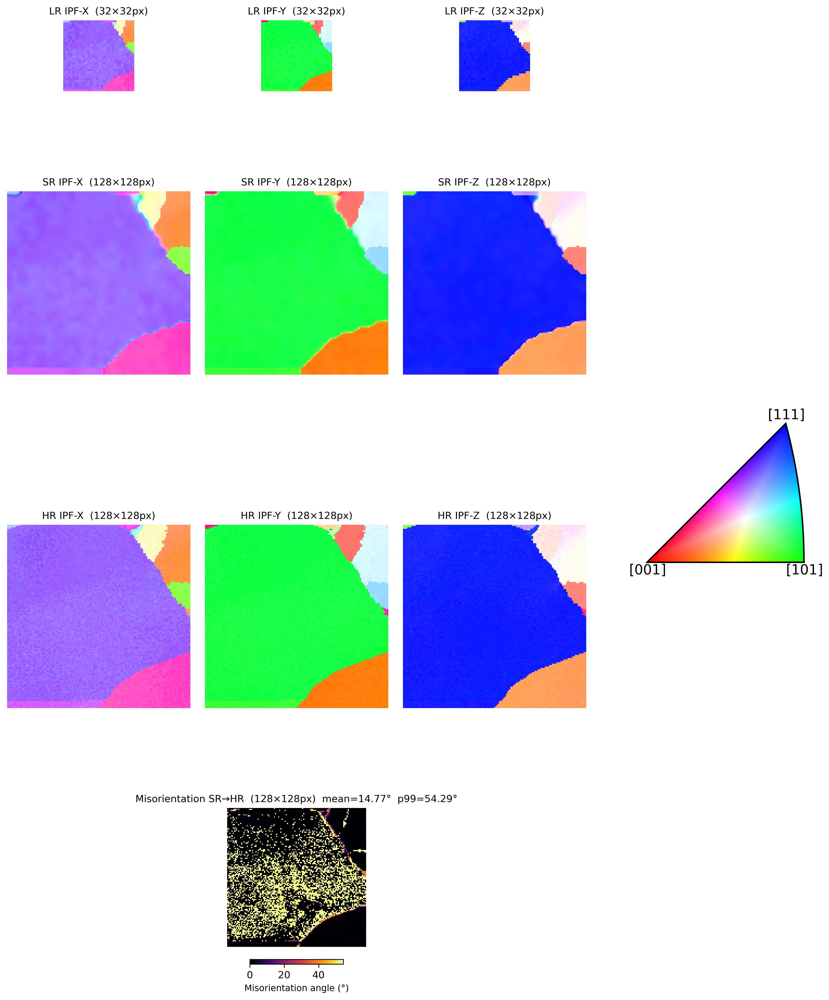

# SG-SRAN (Reynolds-QSR)

Physics-aware, symmetry-constrained super-resolution for EBSD orientation fields using quaternion representations and e3nn/O(3)-equivariant feature processing.

## Sample output

Reference IPF image from the repository:



## What this repository contains

- FCC quaternion encoder/decoder using spherical harmonic features (`l=4`, `l=6`)
- Fast lookup decoder with optional local refinement
- Super-resolution models (transpose-conv and attention variants)
- Training and inference scripts for IN718 experiments
- Evaluation metrics (misorientation, IPF MSE/PSNR/SSIM)

## Repository structure

- `models/`: autoencoders, SR architectures, lookup decoder
- `training/`: training loops, config loading, checkpoints, data loading
- `builders/`: dataset builders/utilities
- `scripts/`: train/test/debug helpers
- `tests/`: unit and integration tests
- `experiments/`: experiment folders, configs, checkpoints, outputs

## Environment setup

```bash
conda create -n material python=3.10 -y
conda activate material
pip install -r requirements.txt
```

If you use GPUs, ensure CUDA/PyTorch versions are compatible with your system.

## Training

Create an experiment directory with a config (for example under `experiments/IN718/...`) and run:

```bash
./scripts/train.sh experiments/IN718/<experiment_name>
```

Optional multi-GPU (DDP):

```bash
CUDA_VISIBLE_DEVICES=0,1,2,3 ./scripts/train_ddp.sh experiments/IN718/<experiment_name> <num_gpus>
```

## Inference / evaluation

Example:

```bash
conda run -n material python test_inference.py \
  --checkpoint experiments/IN718/LAE_sr_double_conv_attn_01/2026-02-27_11-36-07/checkpoints/best_model.pt \
  --gpu_ids 0 \
  --dpi 150
```

Optional lookup refinement at inference:

```bash
conda run -n material python test_inference.py \
  --checkpoint experiments/IN718/LAE_sr_double_conv_attn_01/2026-02-27_11-36-07/checkpoints/best_model.pt \
  --refine_steps 100
```

## Tests

Run all tests:

```bash
./scripts/run_tests.sh
```

Or use pytest directly:

```bash
pytest -q
```

## Notes

- Lookup-table decoding uses chunked nearest-neighbor search for memory efficiency.
- Optional refinement in `FastLookupFCCDecoder` optimizes quaternion seeds at test time against predicted `(f4, f6)` features.
- Experiment outputs are written under the corresponding `experiments/.../<timestamp>/` directory.