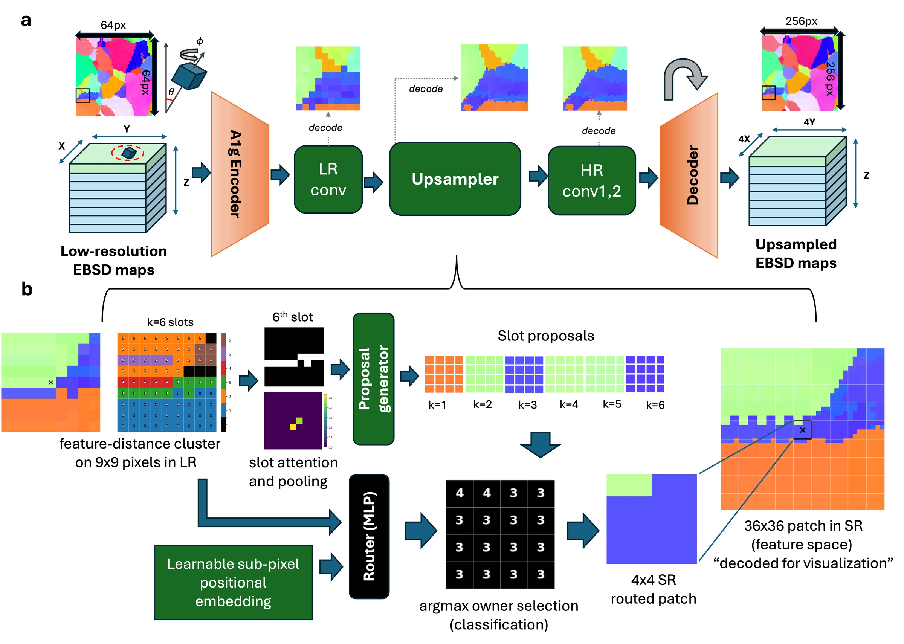
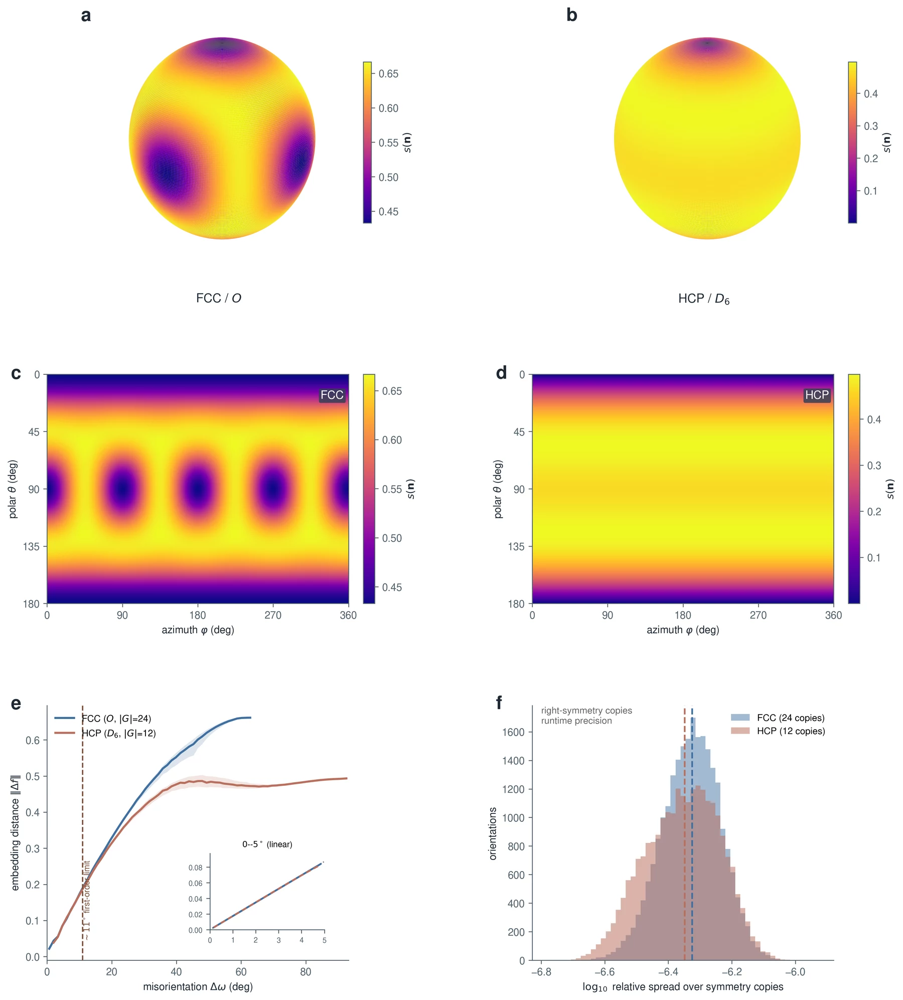
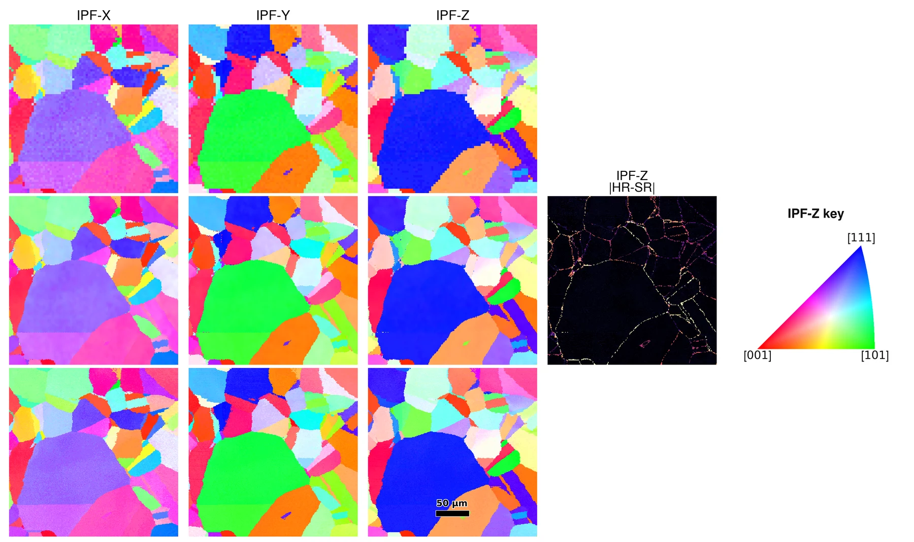
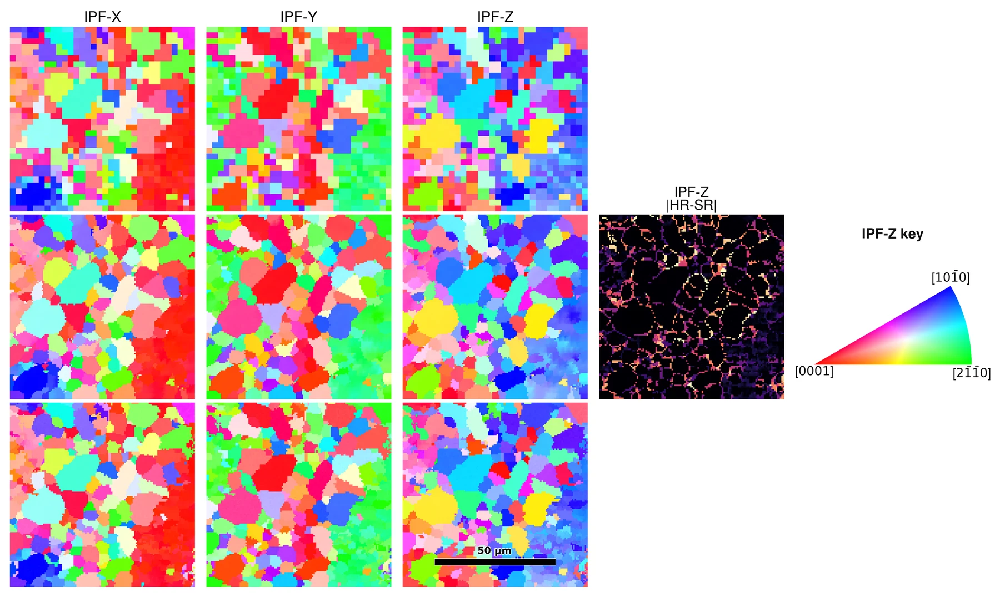

# SG-SRAN

**Symmetry-Group-Aware Super-Resolution Attention Network for EBSD orientation maps**

[Project page](https://umang-garg21.github.io/SG-SRAN/) | [Code](https://github.com/umang-garg21/SG-SRAN)

SG-SRAN reconstructs high-resolution crystal orientations from sparsely sampled
EBSD maps. It treats an orientation as a point in the quotient
`SO(3)/G`, where `G` is the crystal symmetry group, and performs
super-resolution in a symmetry-invariant latent space.



## Method

1. **Invariant encoding.** Direct Reynolds projection maps
   symmetry-equivalent orientations to the same feature vector. The retained
   harmonic degrees are `l = 4` for FCC and `l = 2, 4, 6` for HCP.
2. **Local-isometry calibration.** Fixed block scales make small latent
   distances track small misorientation angles.
3. **Routed upsampling.** Local feature clusters define candidate orientation
   branches. A learned router assigns each high-resolution subpixel to one
   candidate before convolutional refinement.
4. **Dictionary decoding.** A fixed symmetry-specific dictionary maps the
   refined latent field back to unit quaternions.



## Scope

- `4x4` EBSD orientation-map super-resolution for FCC IN718 and HCP
  Ti-6Al-4V.
- Crystal-symmetry-aware training and evaluation under the proper cubic `O`
  and hexagonal `D6` rotation groups.
- Zero-shot evaluation on unseen FCC and HCP alloys.
- Representation, routing, boundary, scaling, and round-trip diagnostics.

## Evidence

The paper compares SG-SRAN with four deterministic interpolants and seven
learned baselines over five seeds. The trainable backbone contains about
`49k` parameters for FCC and `27k` for HCP, compared with `15-16M` for the
largest learned baselines. Encoder-dictionary round-trip errors are
`0.0076 rad` for FCC and `0.0079 rad` for HCP.

<p>
  
  
</p>

## Repository

| Path | Purpose |
| --- | --- |
| `models/local_iso_embedding.py` | Reynolds-projected FCC and HCP encoders |
| `models/SR_4x4_from_4x1_ocrp_anchorless.py` | Routed `4x4` SG-SRAN backbone |
| `training/train_iso_embedding_ocrp.py` | Training entry point |
| `inference/infer_iso_embedding_sr_attn.py` | Quaternion and IPF-map inference |
| `configs/` | Reference FCC and HCP configurations |
| `analysis/Table1/encoder_roundtrip_table1.py` | Encoder-dictionary round-trip evaluation |
| `tests/` | Symmetry, encoder, routing, and entry-point regression tests |

## Environment

The current implementation is tested with Python 3.10, PyTorch 2.5,
`e3nn 0.5.9`, and `orix 0.13.0`. A CUDA-capable PyTorch installation is
recommended for training and dictionary decoding.

```bash
python -m venv .venv
source .venv/bin/activate
pip install torch torchvision
pip install e3nn==0.5.9 orix==0.13.0
pip install numpy scipy scikit-image scikit-learn matplotlib einops imageio opencv-python pillow tqdm tensorboard
```

## Train

Choose one reference configuration, copy it into an experiment directory, and
set `dataset_root` to the corresponding prepared dataset.

```bash
mkdir -p experiments/IN718/sgsran_4x4
cp configs/in718_fcc_4x4.json experiments/IN718/sgsran_4x4/config_new.json

python -m training.train_iso_embedding_ocrp \
  --exp_dir experiments/IN718/sgsran_4x4 \
  --config config_new.json \
  --gpu_ids 0
```

Use `configs/ti6al4v_hcp_4x4.json` for the HCP configuration. Add `--resume`
to continue from `checkpoints/last_checkpoint.pt`.

## Infer

```bash
python -m inference.infer_iso_embedding_sr_attn \
  --exp_dir experiments/IN718/sgsran_4x4 \
  --config config_new.json \
  --checkpoint best_model.pt \
  --split Test \
  --gpu_ids 0
```

Predicted quaternions, IPF maps, and summary metrics are written under
`<exp_dir>/inference/`.

## Verify

```bash
pytest tests/test_dynamic_symmetry_evaluator.py \
       tests/test_iso_embedding_sr_attn_model.py \
       tests/test_sr_ocrp_model.py
```
