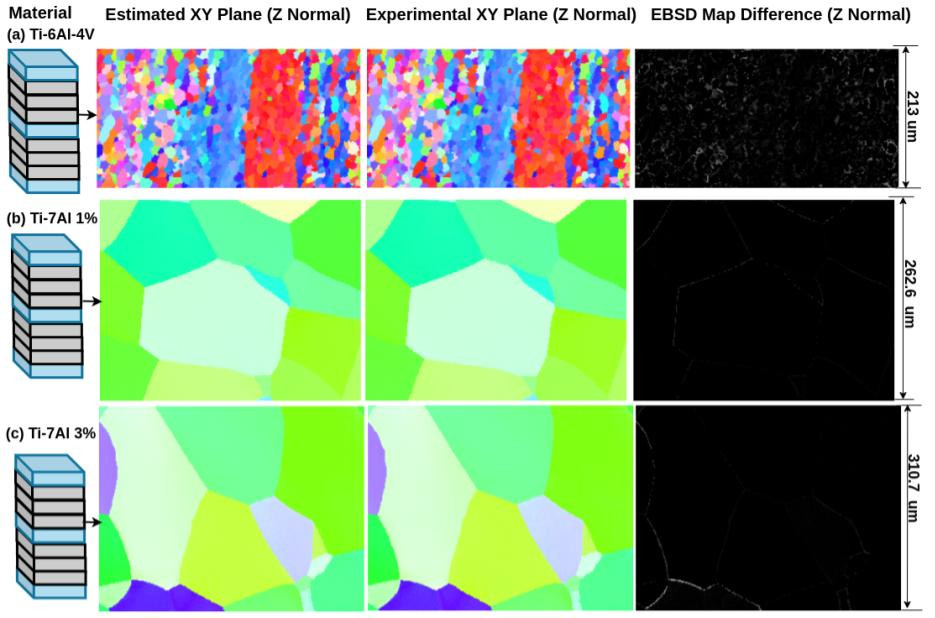
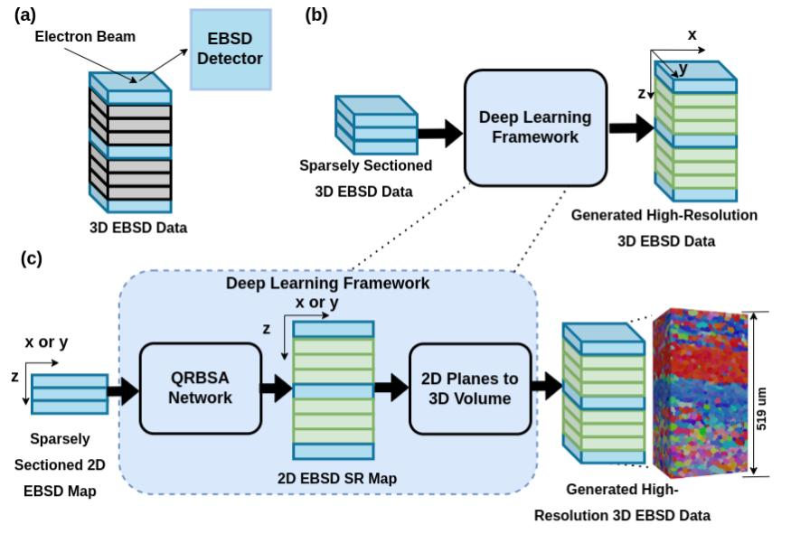
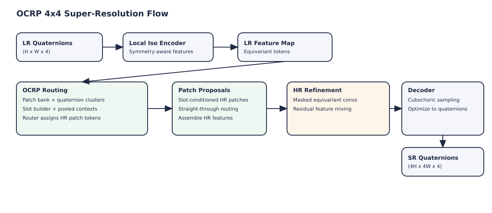

# Reynolds-QSR: OCRP 4x4 Repository


Task: recover high-resolution crystalline orientation fields from low-resolution
EBSD quaternion maps. OCRP is the network used to address symmetry-crossings and
grain-boundary aberrations that arise in naive SR architectures:
- Symmetry boundary crossings: interpolate across symmetry zones via irreps.
- Grain boundary interpolation: preserve discontinuities with masking.
- Limited learnability from local context: use routed slots to capture broader
  material statistics.
- Interpretability gaps in learnable SR: expose slot usage and routing signals.
The figure summarizes the problem setting and the qualitative gains.


Results overview comparing LR, SR, and HR orientation reconstructions.


3D EBSD projection used to contextualize the super-resolution targets.

This repository focuses on OCRP 4x4 quaternion super-resolution for crystalline
orientation fields. The core workflow is:
- Train `IsoEmbeddingSROCRP` (OCRP 4x4).
- Run inference from LR quaternion maps to SR quaternion maps.
- Visualize LR/SR/HR with IPF maps and OCRP stage probes.

Legacy code and generated artifacts are preserved under `archive/`.

## Model Snapshot

The OCRP pipeline encodes LR quaternions into symmetry-aware equivariant
features, routes HR patch tokens through clustered orientation slots, and
refines HR features with masked equivariant convolutions before decoding back
to quaternions via cubochoric sampling.

## Core Files

- `models/SR_ocrp.py`
- `models/local_iso_embedding.py`
- `training/train_iso_embedding_ocrp.py`
- `training/run_iso_embedding_ocrp_IN718.sh`
- `inference/infer_iso_embedding_sr_attn.py`
- `inference/run_infer_iso_embedding_sr_attn.sh`
- `analysis/probe_ocrp_stages.py`
- `analysis/probe_ocrp_macro_stages.py`
- `experiments/IN718/iso_embedding_4x4_ocrp_01/config_new.json`
- `experiments/IN718/iso_embedding_4x4_ocrp_01/config_smoke.json`

## Install

```bash
python -m venv .venv
source .venv/bin/activate
pip install -r requirements.txt
```

## Test

```bash
pytest
```

The active test suite is scoped to `tests/` via `pytest.ini` and ignores `archive/`.

## Train

IN718 OCRP 4x4 training:

```bash
python -m training.train_iso_embedding_ocrp \
  --exp_dir experiments/IN718/iso_embedding_4x4_ocrp_01 \
  --config config_new.json \
  --gpu_ids 0
```

Resume:

```bash
python -m training.train_iso_embedding_ocrp \
  --exp_dir experiments/IN718/iso_embedding_4x4_ocrp_01 \
  --config config_new.json \
  --gpu_ids 0 \
  --resume
```

Smoke run:

```bash
python -m training.train_iso_embedding_ocrp \
  --exp_dir experiments/IN718/iso_embedding_4x4_ocrp_01 \
  --config config_smoke.json \
  --gpu_ids 0
```

Scripted run:

```bash
./training/run_iso_embedding_ocrp_IN718.sh \
  --exp_dir experiments/IN718/iso_embedding_4x4_ocrp_01 \
  --config config_new.json
```

## Inference

```bash
./inference/run_infer_iso_embedding_sr_attn.sh \
  --exp_dir experiments/IN718/iso_embedding_4x4_ocrp_01 \
  --checkpoint best_model.pt \
  --split Test
```

Inference outputs are written to:
- `experiments/.../inference/<split>/sr_quaternions/*.npy`
- `experiments/.../inference/<split>/ipf/*.png`
- `experiments/.../inference/<split>/summary.json`

## Configuration Notes

Key OCRP settings live in the experiment config:
- `upsample_factor`: set to `4` for 4x4.
- `window_size`, `kmax_slots`: local clustering and slot routing capacity.
- `ocrp_router_*`, `ocrp_proposal_*`: router and proposal network sizes.
- `use_hr_conv1/2`: HR refinement stack.

## OCRP Stage Probes

Run stage probes for a single sample:

```bash
python analysis/probe_ocrp_stages.py \
  --exp_dir experiments/IN718/iso_embedding_4x4_ocrp_01 \
  --split Val \
  --sample_idx 0
```

Macro-tile probes:

```bash
python analysis/probe_ocrp_macro_stages.py \
  --exp_dir experiments/IN718/iso_embedding_4x4_ocrp_01 \
  --split Val \
  --sample_idx 0
```

## Architecture Diagram



The diagram highlights the OCRP routing block: local patch banks form clustered
orientation slots, the router assigns HR patch tokens, and the assembled HR
features are refined before decoding back to quaternions.
\mathcal{L}_{\mathrm{SR}} &= \frac{1}{BN_{\mathrm{HR}}}
\sum_{b,n}
\left\|
\widehat{\mathbf{z}}_{\mathrm{HR},b,n}
-
\mathbf{z}_{\mathrm{HR},b,n}
\right\|_2^2.
\end{align}
\(E_{a1}\) targets are computed without gradient flow (detached).

\section{Inference}
\[
\widehat{\mathbf{Q}}_{\mathrm{SR}}=
\mathrm{Decode}_{a1}\!\left(
P_{\mathrm{full}\to a1}\!\left(
\mathrm{Attention}\!\left(
\mathrm{Conv}_{\mathrm{HR1}}\!\left(
\mathrm{UpConv}\!\left(
\mathrm{Conv}_{\mathrm{LR2}}\!\left(
\mathrm{Conv}_{\mathrm{LR1}}\!\left(
E_{a1}(\mathbf{Q}_{\mathrm{LR}})
\right)\right)\right)\right)\right)\right)\right).
\]

\begin{algorithm}[H]
\caption{One Training Iteration}
\begin{algorithmic}[1]
\State Input batch: \(\mathbf{Q}_{\mathrm{LR}},\mathbf{Q}_{\mathrm{HR}}\)
\State Normalize quaternions
\State \(\mathbf{z}_{\mathrm{LR}}\gets E_{a1}(\mathbf{Q}_{\mathrm{LR}})\) (detach)
\State \(\mathbf{z}_{\mathrm{HR}}\gets E_{a1}(\mathbf{Q}_{\mathrm{HR}})\) (detach)
\State \(\widehat{\mathbf{z}}_{\mathrm{HR}}\gets F_{\mathrm{SR}}(\mathbf{z}_{\mathrm{LR}})\)
\State \(\mathcal{L}\gets \mathrm{MSE}(\widehat{\mathbf{z}}_{\mathrm{HR}},\mathbf{z}_{\mathrm{HR}})\)
\State Backpropagate \(\mathcal{L}\), gradient-clip, optimizer step
\end{algorithmic}
\end{algorithm}

\begin{algorithm}[H]
\caption{Inference (LR \(\to\) SR Quaternion Map)}
\begin{algorithmic}[1]
\State Input \(\mathbf{Q}_{\mathrm{LR}}\), shape \((H,W)\)
\State \(\mathbf{z}_{\mathrm{LR}}\gets E_{a1}(\mathbf{Q}_{\mathrm{LR}})\)
\State \(\widehat{\mathbf{z}}_{\mathrm{HR}}\gets F_{\mathrm{SR}}(\mathbf{z}_{\mathrm{LR}})\)
\State \(\widehat{\mathbf{Q}}_{\mathrm{raw}}\gets \mathrm{Decoder}_{a1}(\widehat{\mathbf{z}}_{\mathrm{HR}})\)
\State \(\widehat{\mathbf{Q}}_{\mathrm{SR}}\gets \mathrm{ReduceToFZ}(\widehat{\mathbf{Q}}_{\mathrm{raw}})\)
\State Return \(\widehat{\mathbf{Q}}_{\mathrm{SR}}\)
\end{algorithmic}
\end{algorithm}

\end{document}
```
