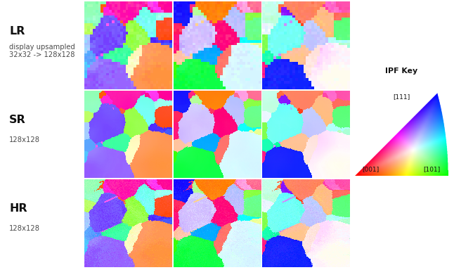

# Reynolds-QSR: OCRP 4x4 Repository




**Task overview.** Recover high-resolution crystalline orientation fields from
low-resolution EBSD quaternion maps. OCRP (Orientation-Cluster Routed Patches)
addresses key failure modes in baseline SR:
- Symmetry boundary crossings: interpolate across symmetry zones via irreps.
- Grain boundary interpolation: preserve discontinuities with masking.
- Limited learnability from local context: route slots to capture broader
  material statistics.
- Interpretability gaps in learned SR: expose slot usage and routing signals.


**Qualitative results.** LR, SR, and HR orientation reconstructions.


**3D EBSD projection.** Context for the super-resolution targets.

This repository focuses on OCRP 4x4 quaternion super-resolution for crystalline
orientation fields. The core workflow is:
- Train `IsoEmbeddingSROCRP` (OCRP 4x4).
- Run inference from LR quaternion maps to SR quaternion maps.
- Visualize LR/SR/HR with IPF maps and OCRP stage probes.

Legacy code and generated artifacts are preserved under `archive/`.

## Model Snapshot

The OCRP pipeline encodes LR quaternions into symmetry-aware equivariant
features, routes HR patch tokens through clustered orientation slots, and
refines HR features with masked equivariant convolutions before decoding back
to quaternions via cubochoric sampling.

## Architecture Diagram


The diagram highlights the OCRP routing block: local patch banks form clustered
orientation slots, the router assigns HR patch tokens, and the assembled HR
features are refined before decoding back to quaternions.

## Core Files

- `models/SR_ocrp.py`
- `models/local_iso_embedding.py`
- `training/train_iso_embedding_ocrp.py`
- `training/run_iso_embedding_ocrp_IN718.sh`
- `inference/infer_iso_embedding_sr_attn.py`
- `inference/run_infer_iso_embedding_sr_attn.sh`
- `analysis/probe_ocrp_stages.py`
- `analysis/probe_ocrp_macro_stages.py`
- `experiments/IN718/iso_embedding_4x4_ocrp_01/config_new.json`
- `experiments/IN718/iso_embedding_4x4_ocrp_01/config_smoke.json`

## Install

```bash
python -m venv .venv
source .venv/bin/activate
pip install -r requirements.txt
```

## Test

```bash
pytest
```

The active test suite is scoped to `tests/` via `pytest.ini` and ignores `archive/`.

## Train

IN718 OCRP 4x4 training:

```bash
python -m training.train_iso_embedding_ocrp \
  --exp_dir experiments/IN718/iso_embedding_4x4_ocrp_01 \
  --config config_new.json \
  --gpu_ids 0
```

Resume:

```bash
python -m training.train_iso_embedding_ocrp \
  --exp_dir experiments/IN718/iso_embedding_4x4_ocrp_01 \
  --config config_new.json \
  --gpu_ids 0 \
  --resume
```

Smoke run:

```bash
python -m training.train_iso_embedding_ocrp \
  --exp_dir experiments/IN718/iso_embedding_4x4_ocrp_01 \
  --config config_smoke.json \
  --gpu_ids 0
```

Scripted run:

```bash
./training/run_iso_embedding_ocrp_IN718.sh \
  --exp_dir experiments/IN718/iso_embedding_4x4_ocrp_01 \
  --config config_new.json
```

## Inference

```bash
./inference/run_infer_iso_embedding_sr_attn.sh \
  --exp_dir experiments/IN718/iso_embedding_4x4_ocrp_01 \
  --checkpoint best_model.pt \
  --split Test
```

Inference outputs are written to:
- `experiments/.../inference/<split>/sr_quaternions/*.npy`
- `experiments/.../inference/<split>/ipf/*.png`
- `experiments/.../inference/<split>/summary.json`

## Atindama Hybrid-Inpainting Baseline

The authors' partial-convolution model is imported unchanged from
`third_party/Atindama-EBSD-Restoration`. The local adapter converts passive
scalar-first quaternions to normalized intrinsic ZXZ Euler angles and places
the LR observations on their exact HR-grid locations.

Train the 4x1 and 4x4 models:

```bash
python training/train_atindama_inpainting.py \
  --exp_dir experiments/IN718/atindama_inpainting_4x1_01 \
  --config config.json \
  --gpu 0

python training/train_atindama_inpainting.py \
  --exp_dir experiments/IN718/atindama_inpainting_4x4_01 \
  --config config.json \
  --gpu 1
```

Run test inference:

```bash
python inference/infer_atindama_inpainting.py \
  --exp_dir experiments/IN718/atindama_inpainting_4x1_01 \
  --checkpoint best_model.pt \
  --split Test \
  --gpu 0
```

The published Criminisi refinement requires a fully known exemplar patch.
Neither periodic sampling mask contains a fully known 3x3 patch, so the exact
second stage is reported as incompatible rather than silently changing its
candidate-patch rule.

## Configuration Notes

Key OCRP settings live in the experiment config:
- `upsample_factor`: set to `4` for 4x4.
- `window_size`, `kmax_slots`: local clustering and slot routing capacity.
- `ocrp_router_*`, `ocrp_proposal_*`: router and proposal network sizes.
- `use_hr_conv1/2`: HR refinement stack.

## OCRP Stage Probes

Run stage probes for a single sample:

```bash
python analysis/probe_ocrp_stages.py \
  --exp_dir experiments/IN718/iso_embedding_4x4_ocrp_01 \
  --split Val \
  --sample_idx 0
```

Macro-tile probes:

```bash
python analysis/probe_ocrp_macro_stages.py \
  --exp_dir experiments/IN718/iso_embedding_4x4_ocrp_01 \
  --split Val \
  --sample_idx 0
```
